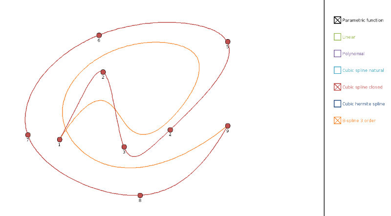

## Curves

Application that uses incanter-interpolation module and build curves from a set of points.

## Install

Application depends on `incanter-interpolation`. It's not released yet so you need to checkout [incanter](https://github.com/liebke/incanter) and run `script/install` to install current snapshot version to local repo.

## Usage

You can launch app via `lein run`.

## Control

mouse left button - add point
mouse right button - remove point
points are draggable

## Screenshot

## License

Common Public License Version 1.0
