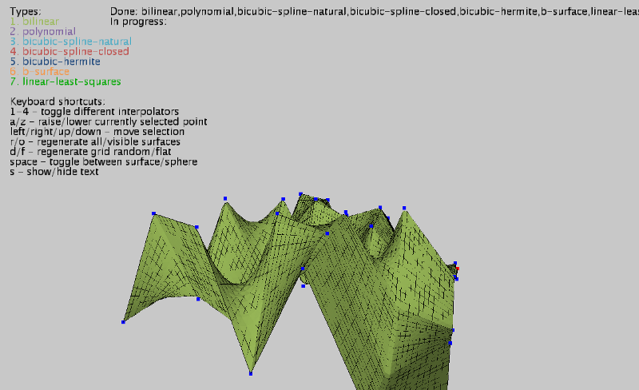

## Surfaces

Application that uses incanter-interpolation functions and build 3d surfaces based on grid of points.

## Install

Application uses [quil](https://gihub.com/quil/quil) for visualization. Surfaces build and visualized using nice [HE_Mesh](http://hemesh.wblut.com/) library. Unfortunately HE_Mesh is not available in any maven repo so you have to install it locally manually. Run `install_libs.sh` (unix) or `install_libs.bat` (windows) to install libs from `libs` directory to your local maven repo. You need to have maven installed. I tried to use lein localrepo plugin but had no luck because of [this](https://github.com/kumarshantanu/lein-localrepo/pull/3) issue.

## Usage

You can launch app via `lein run`.

## Screenshots

Font is ugly. You can switch to opengl renderer(`:renderer :opengl` in sketch function) instead of `:p3d`. I choosed p3d because it's faster on my machine.

## License

Common Public License Version 1.0
